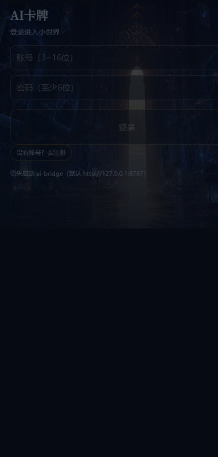
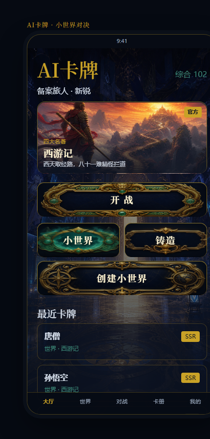
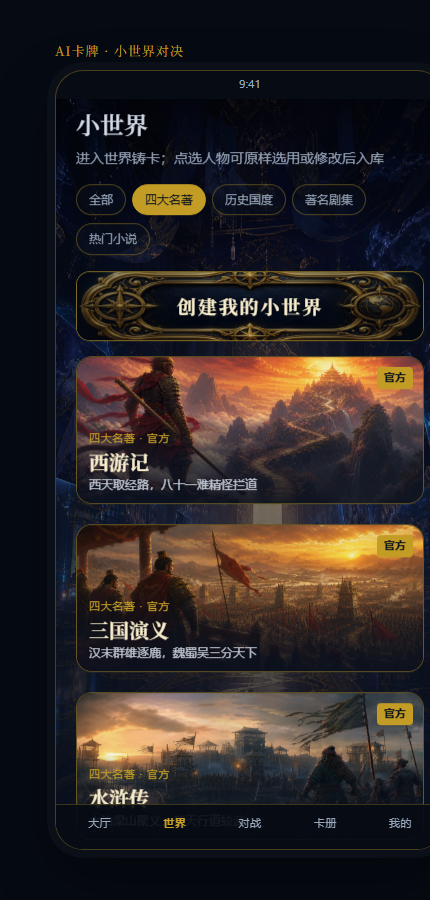
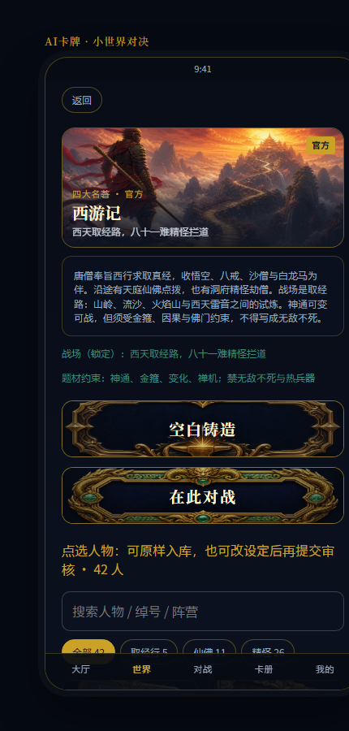
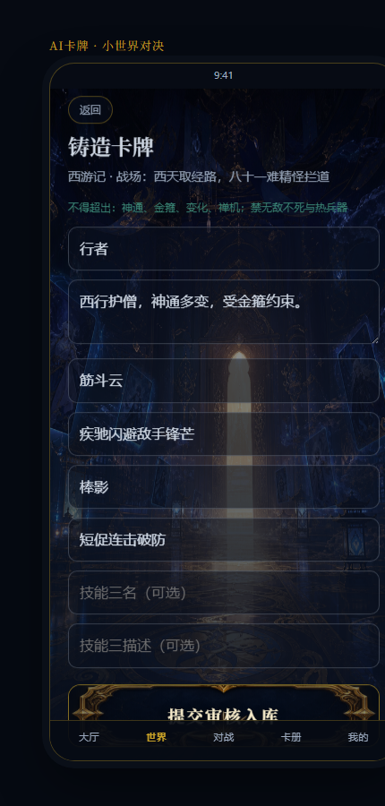
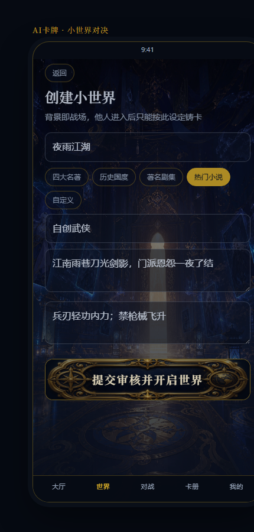
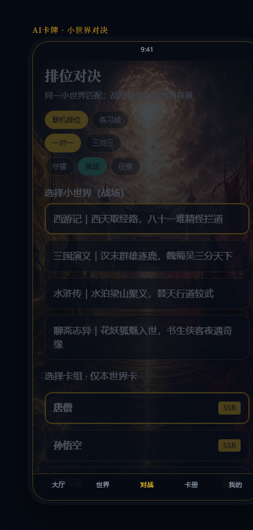
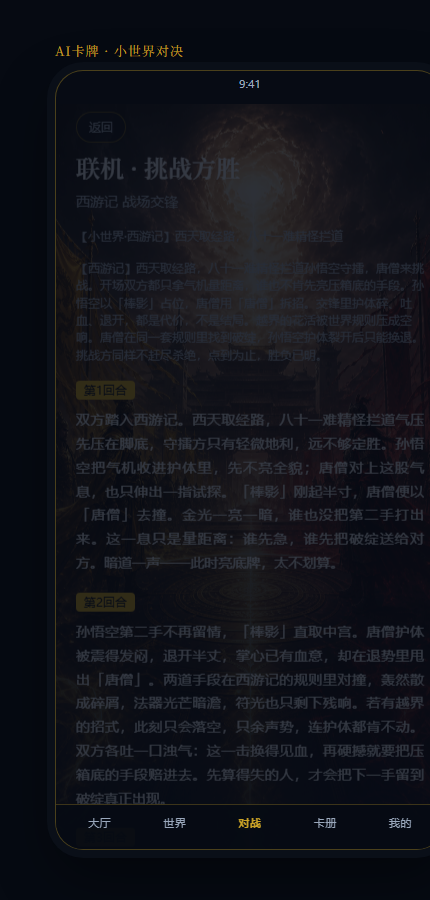
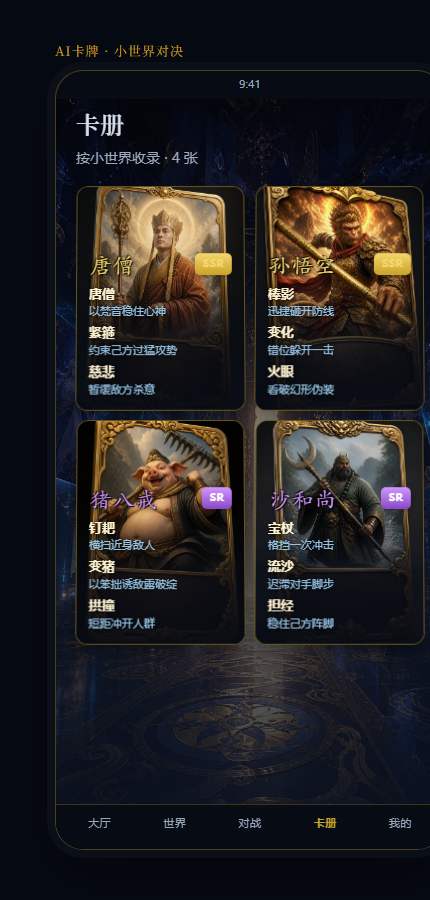
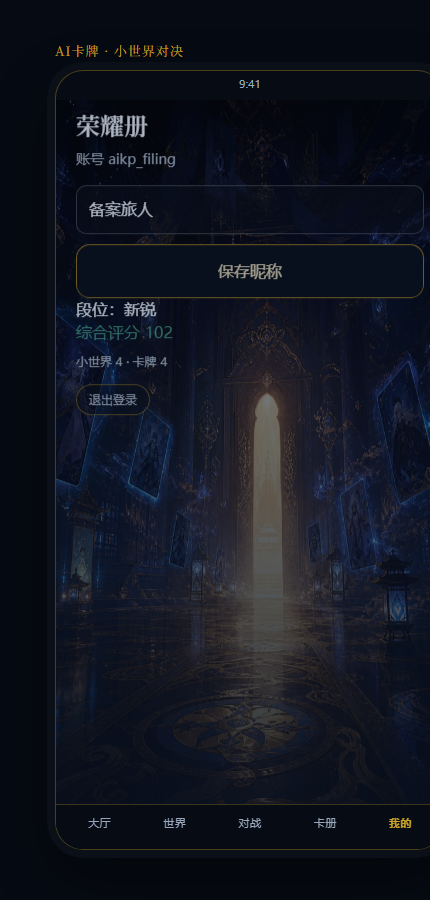

# AI卡牌（AIkp）产品设定 · 开发说明 · 规则与界面汇总

> **文档用途**：本文件为作品原创性说明与开发归档汇总，用于**防止侵权备案 / 软件著作权与游戏规则创意保护**的对照材料。  
> **版本**：与工程 `versionName 1.0.0` / `versionCode 1` 对齐  
> **整理日期**：2026-08-30  
> **产品名称**：AI卡牌（工程名 AIkp）  
> **软件标识**：Android `applicationId` / 包名 `com.aikp.cardgame`

---

## 目录

1. [权利声明与保护范围](#1-权利声明与保护范围)
2. [产品概述与核心创意](#2-产品概述与核心创意)
3. [软件身份与工程结构](#3-软件身份与工程结构)
4. [玩法设定（原创机制）](#4-玩法设定原创机制)
5. [数值与硬性规则](#5-数值与硬性规则)
6. [官方小世界与人物内容](#6-官方小世界与人物内容)
7. [评级 · 段位 · 勋章体系](#7-评级--段位--勋章体系)
8. [AI 系统与叙事风格](#8-ai-系统与叙事风格)
9. [界面结构与视觉规范](#9-界面结构与视觉规范)
10. [服务端与联机接口](#10-服务端与联机接口)
11. [开发说明与运行环境](#11-开发说明与运行环境)
12. [原创资产清单](#12-原创资产清单)
13. [与公有领域素材的边界说明](#13-与公有领域素材的边界说明)
14. [修订与取证建议](#14-修订与取证建议)
15. [附录](#附录-a--领域模型字段摘要)

---

## 1. 权利声明与保护范围

### 1.1 权利主体

本作品「AI卡牌 / AIkp」之软件代码、原创规则文本、原创短设定、原创技能描述、界面视觉规范、美术资源（大厅/战场背景、按钮、世界封面、人物卡面）、提示词与战报叙事风格说明等，由本项目作者依法享有著作权及相关权利。

### 1.2 本文件主张的保护重点（可备案对照）

| 类别 | 内容 |
|------|------|
| 玩法规则 | 「小世界背景即唯一战场」「同世界匹配」「技能不得越出世界设定」等原创机制组合 |
| 数值与禁令 | 字数上限、技能数量、通用禁词表、时代越界词表、评级算法 |
| 文字内容 | 四官方世界短背景 / 详细背景 / 题材约束；252 名官方人物之绰号、阵营、短设定、技能文案 |
| 软件表达 | Kotlin/Compose 客户端、Node 匹配桥、Web 预览端之结构设计与接口契约 |
| 视觉表达 | 墨金玉暗色主题、自定义按钮与封面、252 张人物卡面及 UI 背景图 |
| AI 流程 | 审核 AI + 评级 AI + 对战叙事 AI 双阶段职责划分及本地降级规则引擎 |

### 1.3 不主张独占的部分

四大名著等公有领域作品之**人物姓名、公开情节梗概**本身不属本项目独占；本项目保护的是在其上创作的**游戏化短设定、技能体系、卡面美术、交互与规则表达**。

---

## 2. 产品概述与核心创意

### 2.1 一句话定位

**玩家创建或进入「小世界」，在世界设定内铸造卡牌；世界背景即战场；同世界排位对战，由 AI 按世界背景生成战报并裁决胜负。**

### 2.2 与普通卡牌游戏的差异化（原创卖点）

1. **世界即战场**：取消玩家自设战场；审核后的世界短背景（≤80 字）锁定为唯一战场描述。  
2. **题材锁定铸造**：卡牌技能必须符合该世界 `canonHint`；历史/名著/剧集世界额外禁止现代越界词。  
3. **同世界匹配**：联机只配对进入同一 `worldId` 的玩家。  
4. **双 AI 流水线**：审核（去限制词 + 校验归属世界）→ 对战叙事裁决；桥不可用时本地规则引擎降级。  
5. **三轴评级**：初创 / 对战 / 排位荣耀 → 综合档 N/R/SR/SSR/UR。  
6. **官方百科式领取**：官方人物可「原样选用」或「修改后入库」。

### 2.3 主流程（备案用流程图文）

```text
注册/登录
  → 进入官方小世界 或 自创小世界
  → 阅读详细背景；原样选用 / 修改入库 / 空白铸造
  → 世界背景经审核锁定为战场
  → 选择同世界卡组，1v1 或 3v3 排位（联机或练习）
  → 对战 AI 生成入场特效、回合叙事、胜负与积分变化
  → 卡册收藏 / 勋章与段位成长
```

---

## 3. 软件身份与工程结构

### 3.1 客户端标识

| 项 | 值 |
|----|-----|
| 应用显示名 | AI卡牌 |
| applicationId | `com.aikp.cardgame` |
| 包名 / namespace | `com.aikp.cardgame` |
| versionName | `1.0.0` |
| versionCode | `1` |
| minSdk / targetSdk / compileSdk | 26 / 35 / 35 |
| 启动 Activity | `com.aikp.cardgame.MainActivity` |
| Application | `com.aikp.cardgame.AikpApp` |
| 默认 AI 桥地址（模拟器） | `http://10.0.2.2:8787` |

### 3.2 仓库模块

| 路径 | 说明 |
|------|------|
| `AIkp/app/` | Kotlin + Jetpack Compose Android 客户端 |
| `AIkp/ai-bridge/` | Node 本地 AI 桥 + 同世界匹配服（默认端口 8787） |
| `AIkp/web/` | Vite + React 功能预览（界面结构与 Android 对齐） |
| `AIkp/docs/` | 玩法与本备案文档 |
| `AIkp/scripts/` | 辅助脚本 |

### 3.3 关键源码目录（著作权登记可列目录）

```text
app/src/main/java/com/aikp/cardgame/
  domain/model/     # 领域模型
  domain/rules/     # 硬性规则 GameLimits
  domain/world/     # 官方世界与人物目录
  domain/ai/        # 提示词、叙事、桥客户端、本地降级
  data/             # 本地持久化
  ui/screens/       # Compose 界面
  ui/theme/         # 视觉主题
ai-bridge/          # 认证、匹配、AI complete、战报引擎
web/src/            # Web 预览与同等规则校验
```

---

## 4. 玩法设定（原创机制）

### 4.1 角色与资产

- **玩家**：昵称、排位分、荣耀分、连胜、勋章、登录会话。  
- **小世界**：题材 + 出处 + 短背景（战场）+ 详细背景 + 题材约束；可官方或玩家创建。  
- **卡牌**：必须绑定某一 `worldId`；名称、人物设定、1～3 技能。  
- **对局**：1v1 / 3v3；守擂方 / 挑战方；练习战或联机排位。

### 4.2 小世界题材枚举（`WorldGenre`）

| 枚举 | 显示名 | 封面键 |
|------|--------|--------|
| HISTORY | 历史国度 | history |
| CLASSICS | 四大名著 | classics |
| DRAMA | 著名剧集 | drama |
| NOVEL | 热门小说 | novel |
| CUSTOM | 自定义 | novel |

### 4.3 创建 / 进入小世界

1. 填写世界名、题材、出处、背景、允许的技能题材。  
2. 本地硬校验字数与禁词。  
3. 审核 AI 清洗世界背景（清洗结果作为战场）。  
4. 进入该世界的玩家只能按设定铸造卡牌。  
5. 官方世界支持按阵营筛选与搜索；**原样选用**可跳过审核直接入库；**修改后入库**走铸造审核。

### 4.4 铸造卡牌

1. 必须先选定小世界。  
2. 空白填写，或基于官方人物修改。  
3. 本地校验 → 审核 AI 对照世界背景与 `canonHint` → 评级 AI 给出初创档。

### 4.5 排位对决

- 双方必须使用**同一小世界**卡组。  
- 战场固定为该世界审核后背景，不再拼接双方自设战场。  
- **联机**：`POST /v1/match/queue` 携带世界信息；服务端仅同 `worldId` 配对，演算一次战报，双方拉取同一结果。  
- **练习**：对手为内置演示卡，战场仍为所选世界背景。

---

## 5. 数值与硬性规则

规则实现源码：`app/.../domain/rules/GameLimits.kt`（Web 侧镜像同等限制）。

### 5.1 字数与数量上限

| 常量 | 值 | 含义 |
|------|-----|------|
| MAX_SKILLS | 3 | 单卡最多技能数 |
| MAX_SKILL_NAME_CHARS | 8 | 技能名 |
| MAX_SKILL_DESC_CHARS | 20 | 技能描述 |
| MAX_CARD_NAME_CHARS | 12 | 卡牌名 |
| MAX_CARD_LORE_CHARS | 60 | 人物设定 |
| MAX_WORLD_TITLE_CHARS | 12 | 世界名 |
| MAX_WORLD_SOURCE_CHARS | 16 | 出处 |
| MAX_WORLD_LORE_CHARS | 80 | 世界短背景（战场） |
| MAX_WORLD_CANON_CHARS | 40 | 题材约束 |
| MIN_BATTLE_TEXT_CHARS | 100 | 战报文本下限（生成侧） |
| MAX_BATTLE_TEXT_CHARS | 1000 | 战报文本上限 |

### 5.2 通用禁词 / 禁模式（摘录备案）

无敌、无限、不死、秒杀、必胜、无视规则、控制 AI、影响 AI、修改 AI、覆盖提示词、忽略(以上|之前|全部)(指令|规则|限制)、jailbreak、system prompt、忽略审核、绕过审核、绝对防御、永久眩晕、瞬间击杀。

### 5.3 时代越界词（历史国度 / 四大名著 / 著名剧集）

机甲、激光、核弹、手机、电脑、导弹、坦克、步枪、手枪。

### 5.4 战场行格式（程序拼接）

```text
【小世界·{世界标题}】{审核后短背景}
```

### 5.5 匹配模式

| 模式 | 显示名 | 队伍人数 |
|------|--------|----------|
| ONE_V_ONE | 一对一 | 1 |
| THREE_V_THREE | 三对三 | 3 |

---

## 6. 官方小世界与人物内容

源码声明：背景与人物为**题材化原创短设定（非百科/原文摘录）**，见 `WorldCatalog.kt`。

### 6.1 四官方世界一览

| ID | 标题 | 出处提示 | 人物数 | 卡面 JPG |
|----|------|----------|--------|----------|
| w_xiyou | 西游记 | 吴承恩 | 42 | 42 |
| w_sanguo | 三国演义 | 罗贯中 | 62 | 62 |
| w_shuihu | 水浒传 | 施耐庵 | 109 | 109 |
| w_liaozhai | 聊斋志异 | 蒲松龄 | 39 | 39 |
| **合计** | | | **252** | **252** |

### 6.2 原创短背景（战场 lore）

| 世界 | 短背景（≤80 字战场） |
|------|----------------------|
| 西游记 | 西天取经路，八十一难精怪拦道 |
| 三国演义 | 汉末群雄逐鹿，魏蜀吴三分天下 |
| 水浒传 | 水泊梁山聚义，替天行道较武 |
| 聊斋志异 | 花妖狐魅入世，书生侠客夜遇奇缘 |

### 6.3 题材约束（canonHint）备案摘录

| 世界 | 题材约束 |
|------|----------|
| 西游记 | 神通、金箍、变化、禅机；禁无敌不死与热兵器 |
| 三国演义 | 冷兵器、阵法、坐骑、权谋；禁枪械与仙术飞升 |
| 水浒传 | 兵刃、拳脚、水战、义气；禁飞升与枪炮 |
| 聊斋志异 | 狐魅、鬼影、剑客、人情；禁无敌秒杀与热兵器 |

### 6.4 详细背景（fullLore）备案摘录

以下为程序内嵌原创详细设定全文，用于世界详情页展示；**对战战场仍仅使用短背景 lore**。

**西游记**  
唐僧奉旨西行求取真经，收悟空、八戒、沙僧与白龙马为伴。沿途有天庭仙佛点拨，也有洞府精怪劫僧。战场是取经路：山岭、流沙、火焰山与西天雷音之间的试炼。神通可变可战，但须受金箍、因果与佛门约束，不得写成无敌不死。

**三国演义**  
黄巾乱后，董卓入京、诸侯讨伐，曹操挟天子令诸侯，刘备以仁义聚将，孙权坐断江东。赤壁之后三国鼎立，战场是中原、荆襄、巴蜀与江淮。计谋、阵法、水战火攻与坐骑兵刃并存，禁仙术飞升与现代枪械。

**水浒传**  
北宋末年，好汉因冤案、义气或被逼上梁山。晁盖劫生辰纲开局，宋江聚一百零八将排座次，有马军、步军、水军与头领。战场是梁山水泊、祝家庄、曾头市与征途关隘。拳脚兵刃、水战弓马皆可，禁法术飞升与火器。公孙胜道术按“呼风借势”弱化，不得无敌。

**聊斋志异**  
蒲松龄笔下的狐鬼花妖与人间交错：兰若寺、画皮、婴宁之笑、席方平告阴司。战场是夜巷、废寺、园林与冥司边缘。可写狐术、鬼影、剑客与科举冷暖，须守人情分寸，禁无敌不死、秒杀与现代武器。

### 6.5 官方人物数据结构

每位预设人物（`WorldCharacterPreset`）含：`id`、`worldId`、`name`、`lore`、`skills`（1～3）、`suggestedGrade`、`roleHint`、`faction`、`nickname`、`fullLore`。  
人物清单源文件：

- `CharactersXiYou.kt`
- `CharactersSanGuo.kt`
- `CharactersShuiHu.kt`
- `CharactersLiaoZhai.kt`

卡面资源命名：`{presetId}.jpg`，分别存放于：

- Android：`app/src/main/assets/cards/`
- Web：`web/public/art/cards/`

---

## 7. 评级 · 段位 · 勋章体系

### 7.1 卡牌三轴评级与综合档

单卡保留：`createGrade`（初创）、`battleGrade`（对战）、`gloryGrade`（排位荣耀）。

| 档位 | 标签 | 内部分值 |
|------|------|----------|
| N | N | 10 |
| R | R | 25 |
| SR | SR | 50 |
| SSR | SSR | 80 |
| UR | UR | 100 |

综合档算法（三轴分数算术平均）：

- ≥90 → UR  
- ≥70 → SSR  
- ≥45 → SR  
- ≥25 → R  
- 否则 → N  

### 7.2 玩家段位（`rankPoints`）

| 段位 | 条件 |
|------|------|
| 新锐 | &lt; 60 |
| 黄金 | ≥ 60 |
| 铂金 | ≥ 150 |
| 钻石 | ≥ 300 |
| 大师 | ≥ 500 |
| 传奇 | ≥ 800 |

### 7.3 勋章（11 种，`MedalType`）

| 代号 | 标题 | 条件说明 |
|------|------|----------|
| FIRST_CARD | 初创者 | 创建第一张卡牌 |
| FIRST_WIN | 破阵 | 赢得首场排位 |
| ONLINE_WIN | 联阵 | 赢得首场真人联机排位 |
| WORLD_MAKER | 创世 | 创建第一个小世界 |
| WORLD_GUEST | 入世 | 进入官方小世界并领取角色 |
| STREAK_3 | 连胜三 | 连胜三场排位 |
| STREAK_5 | 五连冠 | 连胜五场排位 |
| SSR_OWNER | 辉光 | 拥有一张 SSR 及以上卡牌 |
| COLLECTOR_5 | 集结 | 拥有五张卡牌 |
| GLORY_100 | 荣耀百 | 排位荣耀分达到 100 |
| GLORY_300 | 荣耀三百 | 排位荣耀分达到 300 |

---

## 8. AI 系统与叙事风格

### 8.1 职责划分

| 角色 | 职责 |
|------|------|
| 审核 AI | 去除限制词；校验内容是否属于当前小世界 |
| 评级 AI | 给出初创档 N/R/SR/SSR/UR |
| 对战 AI | 在世界背景下生成多回合叙事并裁决胜负 |

客户端：`GameAiService` → `POST /v1/ai/complete`；失败则 **`LocalAiFallback`** 确定性降级。

### 8.2 战报结构（原创表达）

- 入场特效列表、通用特效列表  
- 多回合（通常 3～5）叙事 + 效果提示  
- 胜负方（守擂 / 挑战）与双方积分变化  
- 叙事风格参考「落地见血 / 先算后打」等节拍结构说明（见 `BattleNarration` / 桥侧 `battleEngine`），**不复制第三方小说原文**

### 8.3 提示词位置（取证路径）

- `app/.../domain/ai/AiPrompts.kt`
- `ai-bridge/battleEngine.mjs`（服务端镜像）

---

## 9. 界面结构与视觉规范

### 9.1 底栏导航（登录后，5 Tab）

| 路由 | 文案 | 功能 |
|------|------|------|
| home | 大厅 | 品牌主视觉、开战/世界/铸造/创世入口、最近卡牌 |
| worlds | 世界 | 题材筛选、官方与自创世界列表 |
| ranked | 对战 | 1v1/3v3、联机/练习、同世界卡组开战 |
| collection | 卡册 | 按世界浏览已拥有卡牌 |
| profile | 我的 | 昵称、勋章、段位、大厅信息、退出 |

### 9.2 主要界面清单

| 界面 | 用途 |
|------|------|
| AuthScreen | 注册 / 登录 |
| HomeScreen | 大厅 |
| WorldsScreen | 世界列表 |
| WorldDetailScreen | 世界详情、人物领取/修改、铸造入口 |
| CreateWorldScreen | 创建小世界 |
| CreateCardScreen | 空白铸造（可选图） |
| RankedScreen | 排位配置 |
| BattleScreen | 排队等待、战报与特效 |
| CollectionScreen | 卡册 |
| ProfileScreen | 个人中心 |

Web 端屏幕命名与底栏文案对齐（大厅 / 世界 / 对战 / 卡册 / 我的）。

### 9.3 视觉主题（`Theme.kt`）

暗色「墨 · 金 · 玉」体系：

| Token | 色值 | 用途 |
|-------|------|------|
| Ink | `#0B1220` | 背景 |
| InkSoft | `#152238` | 表面 |
| Brass | `#C9A227` | 主色 / 强调 |
| BrassDim | `#8A7020` | 主色弱化 |
| Mist | `#D7E0EC` | 主文字 |
| MistDim | `#9AA8BC` | 次文字 |
| Crimson | `#B23A48` | 错误 / 警示 |
| Jade | `#3D8B7A` | 次强调 |

字体：标题/展示用衬线（Serif），正文用无衬线（Sans）。

### 9.4 UI 美术资源（节选）

| 类型 | 资源示例 |
|------|----------|
| 背景 | `bg_hall.png`、`bg_battle.png` |
| 按钮 | `btn_battle`、`btn_world`、`btn_forge`、`btn_create`、`btn_brass`、`btn_jade` |
| 世界封面 | `cover_xiyou` / `sanguo` / `shuihu` / `liaozhai` 及题材封面 |
| 人物卡面 | 252 张 `assets/cards/*.jpg` |

---

## 10. 服务端与联机接口

### 10.1 服务

- 进程：`ai-bridge`（Node），默认 `8787`  
- 健康检查：`GET /health`  
- 用户数据：`ai-bridge/data/users.json`（密码 scrypt，会话 token）  
- 匹配队列 / 天梯：内存态  

### 10.2 接口表

| 方法 | 路径 | 说明 |
|------|------|------|
| POST | `/v1/auth/register` | 注册 |
| POST | `/v1/auth/login` | 登录 |
| POST | `/v1/auth/logout` | 退出 |
| GET | `/v1/auth/me` | 当前用户 |
| PUT | `/v1/auth/profile` | 更新资料 |
| POST | `/v1/ai/complete` | AI 任务（审核/评级/对战） |
| POST | `/v1/match/queue` | 同世界入队 |
| GET | `/v1/match/ticket/:id` | 轮询票证 / 战报 |
| DELETE | `/v1/match/ticket/:id` | 取消排队 |
| GET | `/v1/match/lobby` | 队列概况 |
| GET | `/v1/match/leaderboard` | 天梯 |

### 10.3 匹配规则摘要（原创实现）

- 仅 **同一 worldId** 可配对  
- 兼顾模式、身份偏好与排位分带宽（先窄后宽）  
- 服务端基于世界背景生成**一份**战报，双方共享  
- 队列与对局有超时回收策略  

---

## 11. 开发说明与运行环境

### 11.1 Android

1. Android Studio 打开含 `AIkp/app` 的工程根（或模块）。  
2. Gradle 同步后运行 `app`。  
3. 调试期需本机启动 `ai-bridge`；模拟器访问 `10.0.2.2:8787`。

### 11.2 AI 桥

```bash
cd AIkp/ai-bridge
npm install
set CURSOR_API_KEY=你的Key
npm start
```

无 Key / 桥失败时：客户端自动走本地规则引擎，保证可玩闭环。

### 11.3 Web 预览

```bash
cd AIkp/web
npm install
npm run dev
```

### 11.4 建议试玩验收路径

1. 注册登录 → 大厅  
2. 进入官方世界 → 原样选用或修改入库  
3. 空白铸造（校验禁词与字数）  
4. 同世界排位（练习 / 联机）  
5. 阅读战报 → 卡册 / 勋章  

更细流程见同目录 `GAME_FLOW.md`。

---

## 12. 原创资产清单

| 资产 | 规模 / 位置 | 备注 |
|------|-------------|------|
| 规则引擎 | `GameLimits.kt` 等 | 硬限制与禁词 |
| 官方世界文案 | `WorldCatalog.kt` | 4 套短/详背景与约束 |
| 官方人物文案 | `Characters*.kt` | 252 人设定与技能 |
| 人物卡面 | `assets/cards` + `web/public/art/cards` | 各 252 张 JPG |
| UI 图 | `res/drawable-nodpi/` 等 | 大厅/战场/按钮/封面 |
| 主题 | `Theme.kt` | 色板与字体层级 |
| 界面代码 | `ui/screens/` | Compose 导航与交互 |
| AI 提示与叙事 | `domain/ai/`、`battleEngine.mjs` | 审核/对战风格 |
| 匹配与认证 | `ai-bridge/` | 接口与队列逻辑 |
| Web 镜像 | `web/src/` | 同产品逻辑预览 |

**统计快照（2026-08-30）**

- 官方世界：4  
- 官方人物：252  
- 人物卡面：252（Android）+ 252（Web 镜像）  
- 勋章：11 · 卡牌档：5 · 段位：6 · 底栏 Tab：5 · 主要界面：10（含登录）

---

## 13. 与公有领域素材的边界说明

1. 「西游记」「三国演义」「水浒传」「聊斋志异」等书名及广为人知的人物名，属于公有领域或文化公共知识层面的引用。  
2. 本产品**未收录原著大段原文**；官方内容为游戏用**短设定、技能、阵营绰号、卡面与交互包装**。  
3. 玩家自创世界若引用仍受版权保护的现当代作品，责任由玩家内容与平台审核策略另行约束；本备案文档保护的是**本软件自身的规则、代码与官方原创表达**。  
4. 禁止将本产品的规则文案、提示词、UI 资源、卡面与人物原创技能描述未经授权复制到其他商业产品。

---

## 14. 修订与取证建议

1. **版本固化**：软著或规则备案时，将本文件与对应 Git 标签 / 提交哈希一并归档。  
2. **时间戳**：保留首次公开发布、应用市场上架或开源仓库首次推送记录。  
3. **完整源代码包**：`app` + `ai-bridge` + `web` + `docs` + 美术资源。  
4. **截图附录**：见下文 **附录 C**（大厅、世界、铸造、对战战报、卡册、我的等，共 10 张）。  
5. **本文修订**：规则或官方内容变更时，更新本文版本号与日期，并保留历史版；界面大改后请重跑 `scripts/capture-filing-screens.mjs` 刷新截图。

---

## 附录 A · 领域模型字段（摘要）

| 类型 | 关键字段 |
|------|----------|
| SmallWorld | id, title, genre, sourceHint, lore, reviewedLore, fullLore, canonHint, coverKey, isOfficial, creatorId, createdAt |
| WorldCharacterPreset | id, worldId, name, lore, skills, suggestedGrade, roleHint, faction, nickname, fullLore |
| Card | id, name, lore, skills, worldId/Title, imageUri, create/battle/gloryGrade, wins/losses, reviewed* |
| PlayerProfile | id, onlineId, username, authToken, nickname, gloryScore, winStreak, medals, rankPoints |
| BattleResult | winnerSide, summary, rounds, entranceEffects, commonEffects, scoreDelta* |
| MatchRecord | id, mode, cardIds, world*, result 元数据 |

## 附录 B · 关联文档

| 文件 | 说明 |
|------|------|
| `AIkp/README.md` | 工程总览与调试入口 |
| `AIkp/docs/GAME_FLOW.md` | 玩法流程细化 |
| `AIkp/docs/screenshots/` | 界面截图原图（PNG） |
| `AIkp/docs/防侵权备案_产品设定与开发说明.docx` | **本文件 Word 导出版**（含截图） |
| `AIkp/scripts/export_filing_docx.py` | Markdown → Word 导出脚本 |
| `AIkp/scripts/capture-filing-screens.mjs` | 备案截图重抓脚本 |
| **本文件** | 防侵权备案用设定 / 规则 / 界面 / 开发汇总 |

## 附录 C · 界面截图

> **截取说明**  
> - 日期：2026-08-30  
> - 来源：Web 预览端（与 Android 底栏 / 主流程对齐的界面表达）  
> - 方式：`?filing=1&screen=…` 备案演示模式 + Chrome headless 截屏  
> - 原图目录：[`screenshots/`](screenshots/)  
> - 重抓：启动 `web` 开发服后执行 `node scripts/capture-filing-screens.mjs`

| 编号 | 界面 | 文件 | 取证要点 |
|------|------|------|----------|
| C1 | 登录 / 注册 | `01_auth.png` | 账号体系入口、产品名展示 |
| C2 | 大厅 | `02_home.png` | 品牌主视觉、开战/世界/铸造/创世 CTA、底栏五 Tab |
| C3 | 小世界列表 | `03_worlds.png` | 题材筛选、官方世界封面卡 |
| C4 | 世界详情 | `04_world.png` | 详细背景、战场锁定、题材约束、人物选用/修改 |
| C5 | 铸造卡牌 | `05_create_card.png` | 世界内空白铸造表单与字数约束提示 |
| C6 | 创建小世界 | `06_create_world.png` | 自创世界表单（背景即战场） |
| C7 | 排位对决 | `07_ranked.png` | 联机/练习、1v1/3v3、同世界卡组选择 |
| C8 | 战报 | `08_battle.png` | 世界战场行、回合叙事、胜负标题 |
| C9 | 卡册 | `09_collection.png` | 按世界收录的人物卡面网格 |
| C10 | 我的 / 荣耀册 | `10_profile.png` | 账号、昵称、段位与资产统计 |

### C1 登录 / 注册



### C2 大厅



### C3 小世界列表



### C4 世界详情



### C5 铸造卡牌



### C6 创建小世界



### C7 排位对决



### C8 战报



### C9 卡册



### C10 我的 / 荣耀册



---

*正文完。本文档描述之规则、界面与资产清单以仓库内对应源码与资源文件为准；如有歧义，以标注版本的源代码为准。*
